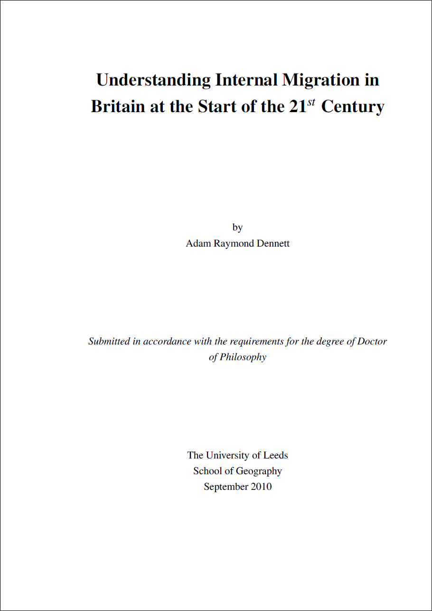

A complete list of my publications can be found on my [UCL Profiles Page](https://profiles.ucl.ac.uk/28795-adam-dennett/publications).

A PDF of my PhD Thesis - not quite publication zero (that was [this paper](https://onlinelibrary.wiley.com/doi/abs/10.1002/psp.554)), but certainly the one that without which, I wouldn't be here, can be downloaded by clicking the image below

