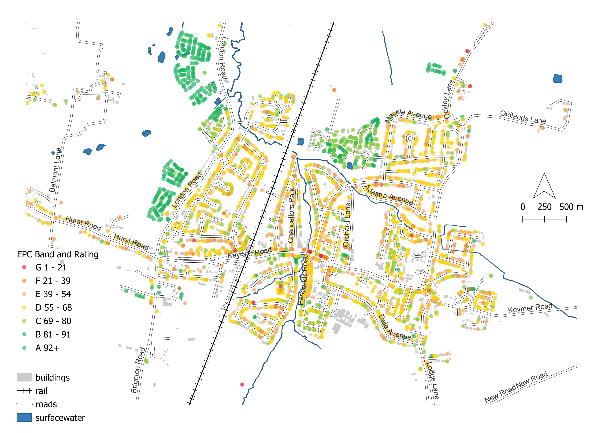

This is a basic walk-through exercise which will enable participants to download Energy Performance Certificate data for a local authority of their choice and then plot the property locations and colour those properties according to variables within the dataset such as age or energy efficiency.
